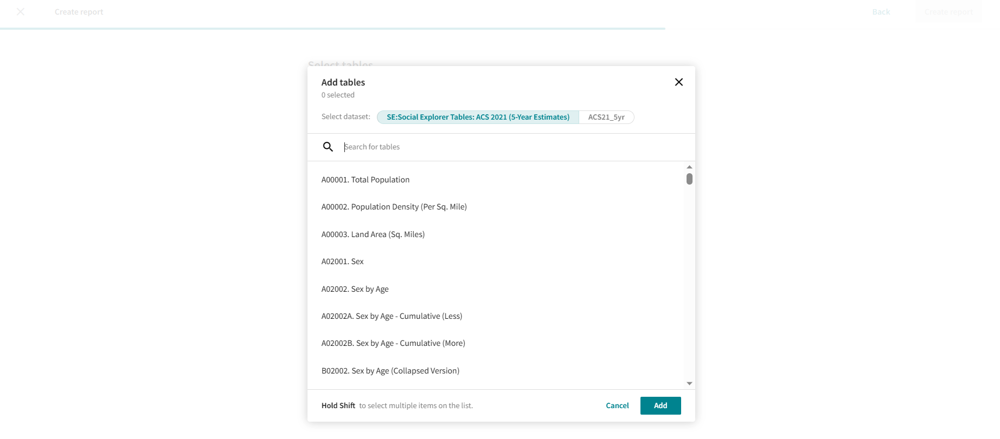
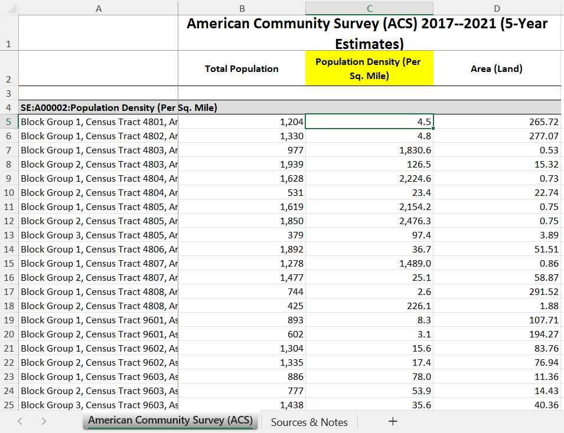
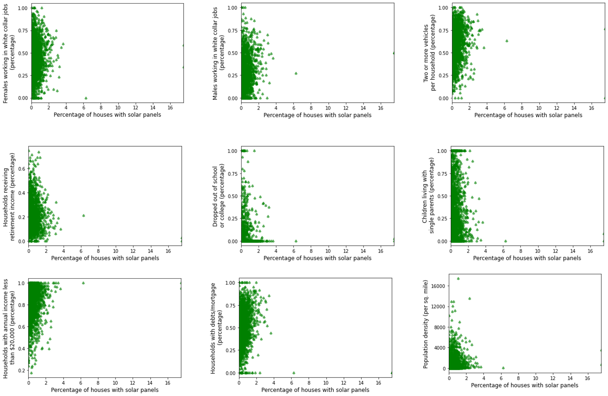

# Stage4: Analysis (abisht)

This file outlines the process of comparing the socio-demographic variables with the solar panel distribution.
We categorize the dataset into two categories:
  1. Solar Panel Distribution: This dataset is received from step4 (image segmentation) and is in the form of a .csv file with the first column listing the primary key for each block group (described further) and the second column listing the number of houses with solar panels. The third column lists the number of solar patches (one house might have more than one solar patches). 
  Primary key is of the form <5-digit county FIPS code>-<6-digit census tract number>-<1-digit block group number>
  
  3. Socio-demographic Dataset: Social Explorer stores multiple ACS (American Community Surveys)reports. We download the 5-year ACS reports from Social Explorer (https://www.socialexplorer.com/a9676d974c/explore). The dataset is downloaded by block group for Arkansas state. 
  This repository currently has the dataset for specific parameters for 23 different variables. This is stored in csv file XXX. The last column in this csv file has the solar panel distribution dataset appended.

  ## Step1: Download the dataset from Social Explorer
  Navigate to https://www.socialexplorer.com/reports/socialexplorer/en/geographies/ACS2021_5yr and select the geographies. 
  
  
  Since our analysis is at the block group level for all block groups in Arkansas, we select 'All Block Groups' and 'All Block Groups in Arkansas'. Click 'Next' and go to the page to select the tables needed. 
  
  
  Select the table(s) needed. Please note that although multiple tables can be selected, but the option to export a table with transposed data in the next step is only available if one table is selected. 
  
  
  For example, we select the report for population density.
  
  
  Select the option to 'Download tranposed Excel (.xlsx)' from right pane. 
  
  
  After opening the excel workbook, determine the column of use. For example, we select population density (per sq. mile) (highlighted in yellow in the following image). 
  
  
  Copy this along with the block group information into another workbook. And do this for all the ACS reports which would result in a workbook as shown below. 
  

  Make sure that the number don't use comma as a separator since while importing the data, using a comma as a delimiter can lead to faulty data extraction. Finally, save this sheet as a csv file. Let's call this 'compiled_data.csv'.
  
## Step2: Change the primary key of the compiled_data.csv file to geoID. 

Run the script 'setGeoID' to generate a file 'sdData.csv'.

Caution: Make sure that there are no empty spaces in the data. If the data downloaded from Social Explorer or the segmentation results have missing data points then either: 1) subsitute missing cells with zeroes or 2) use some missing data handling approaches like average value of the neighboring block groups to fill the blank cells. 

Currently the script is hard-coded for specific socio-demographic variables as shown below. Make sure to change the data extraction for your customized dataset. 

## Step3: Merge sdData.csv with solar panel distribution dataset (solarPanel.csv)

Run the script 'merge' to generate another csv file, 'mergedData.csv'.

The script uses the first column called key as the primary key to combine the two csv files and generate a combined csv file. 

## Step4.1: Analysis (Scatter Plots)
In the first step, we can simply visualize various sociodemographic variables with respect to the solar panel distribution (houses with solar panels or solar panel coverage depending on the dataset being used). This gives a general idea whether there is any variation depending on the sociodemographic variable or not. For most of the variables, one will probably not be able to tell if they are significand drivers for solar panel usage, however, some trends can be observed. 

Script 'scatter_plots' generates all the scatter plots for hardcoded headings. This can be generalized to utilize a generic .csv file. The various scatter plots for our dataset are listed below. 
 

## Step4.2: Analysis (Multiple Linear Regression)
Next, we utilize multiple linear regression to generate the weights for different socio-demographic variables. 
Script 'MLR' receives a csv file as an input. The independent and dependent variables can be listed as an array. One can include more or less headings depending on the case study. Also, the last section can be used to determine the independence of the independent variables. If the correlation is above 0.5, then we ommit the variable from the analysis. The results from the correlation analysis is shown below. 

## Step4.3: Analysis (AutoML) - AutoGluon
We can also utilize auto ML implementations like TPOT or AutoGluon which browse through various models to determine the model that is able to predict the data best and gives a higher R2 score. 
We utilize following AutoGluon script for analysis: https://colab.research.google.com/github/autogluon/autogluon/blob/stable/docs/tutorials/tabular/tabular-indepth.ipynb
