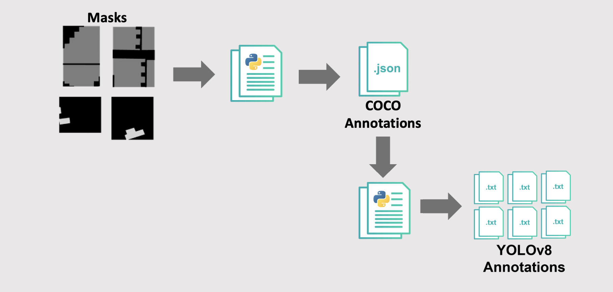

# Overview 
To train the classification and segmentation models, the black-and-white masks corresponding to their respective standard satellite images must be converted into a usable format. We use the two-step process outlined here:

## Binary to COCO annotations conversion
Binary_to_COCO.ipynb is used to convert a set of binary masks, black and white images, into COCO format annotations, which is a JSON file that stores the information about the objects in the images and the relationships between the images and objects. The binary masks are assumed to be stored in a folder titled 'mask_folder'; modify the file path depending on where you have your images. The images are processed one by one. For each mask image, its contours are found and stored as a list of points in the 'segmentation' field of an annotation. The annotations also include information about the image size, object category, and object bounding box. The resulting annotations are saved in a JSON file called 'annotations.json'.

If you want to visualize your COCO annotations, you can take a look at this repo: https://github.com/trsvchn/coco-viewer, which has instructions and information.

## COCO to YOLOv8 annotations conversion
To convert COCO Anotations to YOLOv8 annotations we used COCO2YOLO https://github.com/tw-yshuang/coco2yolo.

To create new YOLOv8 annotations we used Roboflow: https://app.roboflow.com/yolov8test. Roboflow allows you to upload your images, manually annotate them, and load them in our project using their library. 
