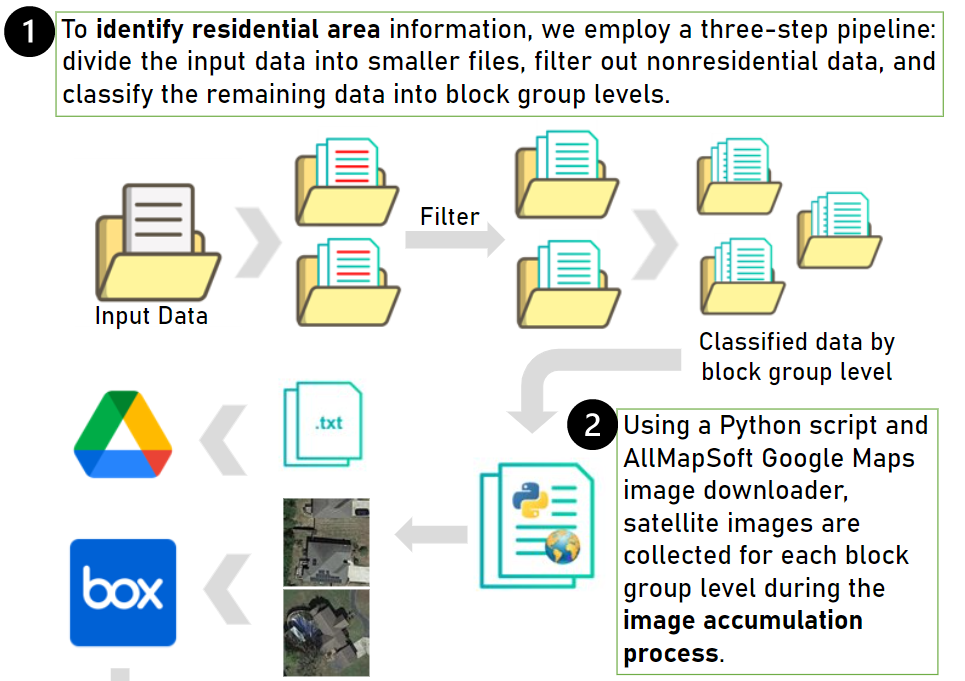
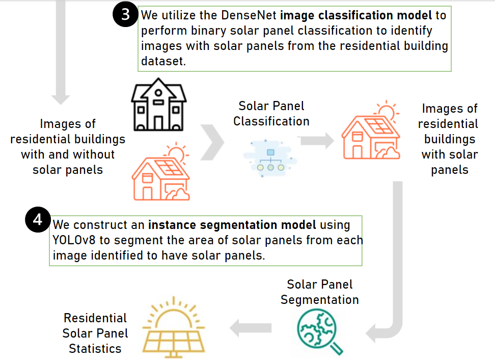
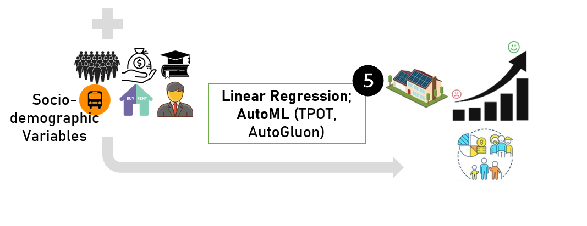
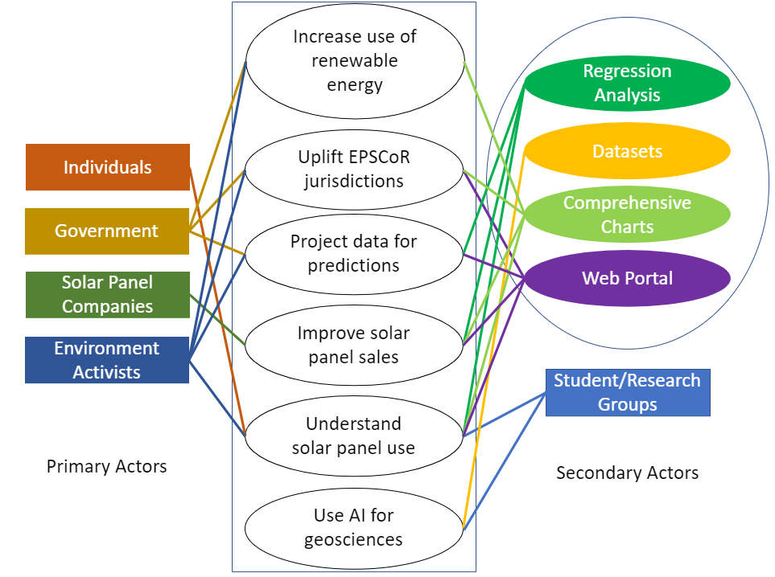

# AI-Supported Analysis of Residential Rooftop Solar Panels in EPSCoR Jurisdictions
Apoorva Bisht, Porfirio Rios Calvo, Shi Yin Hong, Sahibzada Abubakar Qasim, Lukas Vaughan

### *Residential Building Identification*: Pipelines to display/filter/modify geoJson files and retrieve residential building images from the Google API. 

### *Classification + Segmentation*: Models, dataset, and auxiliary tools to support solar panel classification and segmentation.

### *Analysis*: Implementation to support sociodemographic analysis with solar panels distribution.

### *Usecases*

